В проекте используется [pgxpool](https://pkg.go.dev/github.com/jackc/pgx/v5/pgxpool), это защищенный от параллелизма пул соединений для pgx, библиотеки для работы с PostgreSQL.
Установил максимальное количество соединений в пуле равным 100.
Запрос для нагрузочного теста выглядит следующим образом:
```
curl --location 'localhost:8080/v1/user/search?first_name=%D0%9E%D0%BB%D0%B5%D0%B3&last_name=%D0%A8%D0%BE%D0%BA%D0%B8%D0%BD&limit=1' \
--data ''
```
Этот запрос вызывает базу с таким запросом:
```
select
	id,
	email,
	password_hash,
	city_id,
	first_name,
	last_name,
	birthdate,
	gender,
	interests
from
	users
where
	first_name like 'Олег%'
	and last_name like 'Шокин%'
order by
	id asc
limit 2
```
PostreSQL составляет такой план запроса:
```
QUERY PLAN                                                                                                                        |
----------------------------------------------------------------------------------------------------------------------------------+
Limit  (cost=30616.77..30616.77 rows=1 width=154) (actual time=171.005..181.916 rows=0 loops=1)                                   |
  ->  Sort  (cost=30616.77..30616.77 rows=1 width=154) (actual time=171.003..181.913 rows=0 loops=1)                              |
        Sort Key: id                                                                                                              |
        Sort Method: quicksort  Memory: 25kB                                                                                      |
        ->  Gather  (cost=1000.00..30616.76 rows=1 width=154) (actual time=170.981..181.891 rows=0 loops=1)                       |
              Workers Planned: 2                                                                                                  |
              Workers Launched: 2                                                                                                 |
              ->  Parallel Seq Scan on users  (cost=0.00..29616.66 rows=1 width=154) (actual time=152.721..152.722 rows=0 loops=3)|
                    Filter: (((first_name)::text ~~ 'Олег%'::text) AND ((last_name)::text ~~ 'Шокин%'::text))                     |
                    Rows Removed by Filter: 333333                                                                                |
Planning Time: 0.274 ms                                                                                                           |
Execution Time: 182.041 ms                                                                                                        |
```
Если я правильно понял план запроса: \
Запущено 2 потока, который просканировали таблицу по частям, в каждой из которых откнинули по 333 333 записей. \
Это неудивительно, ведь индексов по колонкам first_name и last_name сейчас нет.\
\
Запустил нагрузочный тест на 10 одновременных подключение в течение 5 минут:
```
  scenarios: (100.00%) 1 scenario, 10 max VUs, 5m30s max duration (incl. graceful stop):
           * default: 10 looping VUs for 5m0s (gracefulStop: 30s)

     ✓ status was 200

     █ setup

     checks.........................: 100.00% ✓ 1453     ✗ 0   
     data_received..................: 222 kB  740 B/s
     data_sent......................: 260 kB  865 B/s
     http_req_blocked...............: avg=39.8µs  min=3.8µs    med=5.58µs  max=11.32ms p(90)=6.71µs   p(95)=7.73µs  
     http_req_connecting............: avg=24.83µs min=0s       med=0s      max=11.17ms p(90)=0s       p(95)=0s      
     http_req_duration..............: avg=2.06s   min=462.1ms  med=2.05s   max=4.6s    p(90)=2.99s    p(95)=3.37s   
       { expected_response:true }...: avg=2.06s   min=462.1ms  med=2.05s   max=4.6s    p(90)=2.99s    p(95)=3.37s   
     http_req_failed................: 0.00%   ✓ 0        ✗ 1453
     http_req_receiving.............: avg=84.42µs min=32.5µs   med=77.02µs max=1.39ms  p(90)=104.52µs p(95)=119.57µs
     http_req_sending...............: avg=40.16µs min=18.73µs  med=25.58µs max=5.4ms   p(90)=52.77µs  p(95)=67.71µs 
     http_req_tls_handshaking.......: avg=0s      min=0s       med=0s      max=0s      p(90)=0s       p(95)=0s      
     http_req_waiting...............: avg=2.06s   min=462.04ms med=2.05s   max=4.6s    p(90)=2.99s    p(95)=3.37s   
     http_reqs......................: 1453    4.834108/s
     iteration_duration.............: avg=2.06s   min=17.53µs  med=2.05s   max=4.6s    p(90)=2.99s    p(95)=3.38s   
     iterations.....................: 1453    4.834108/s
     vus............................: 10      min=10     max=10
     vus_max........................: 10      min=10     max=10

running (5m00.6s), 00/10 VUs, 1453 complete and 0 interrupted iterations
default ✓ [======================================] 10 VUs  5m0s
```
Графики:

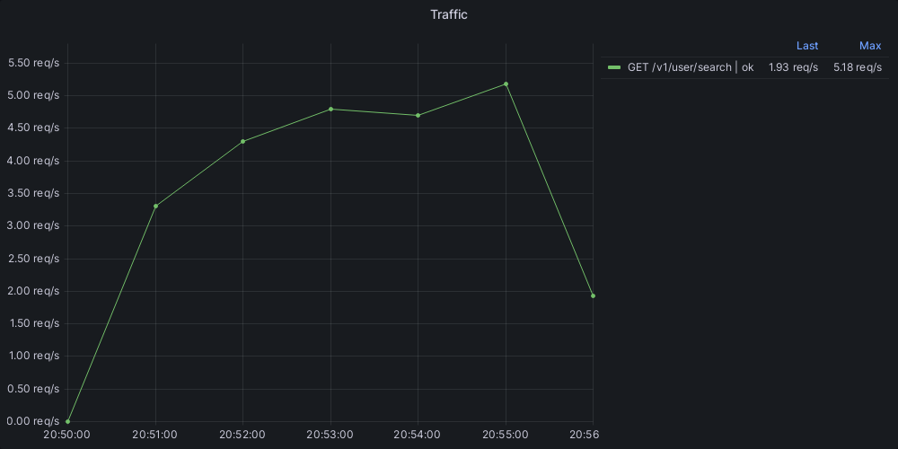
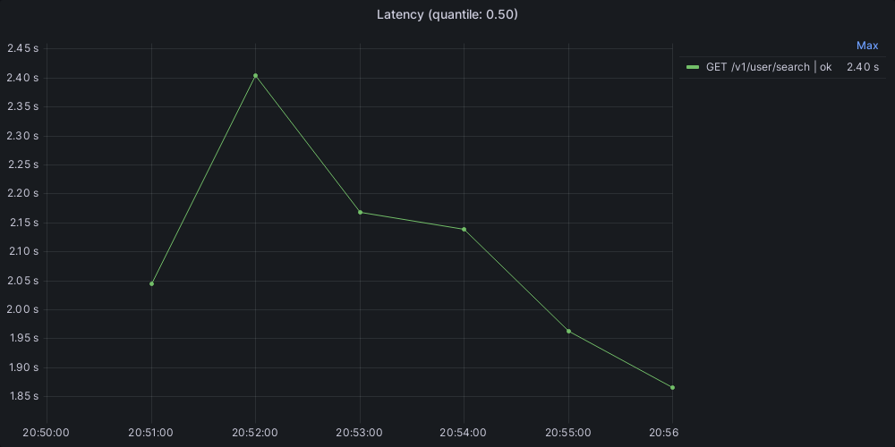
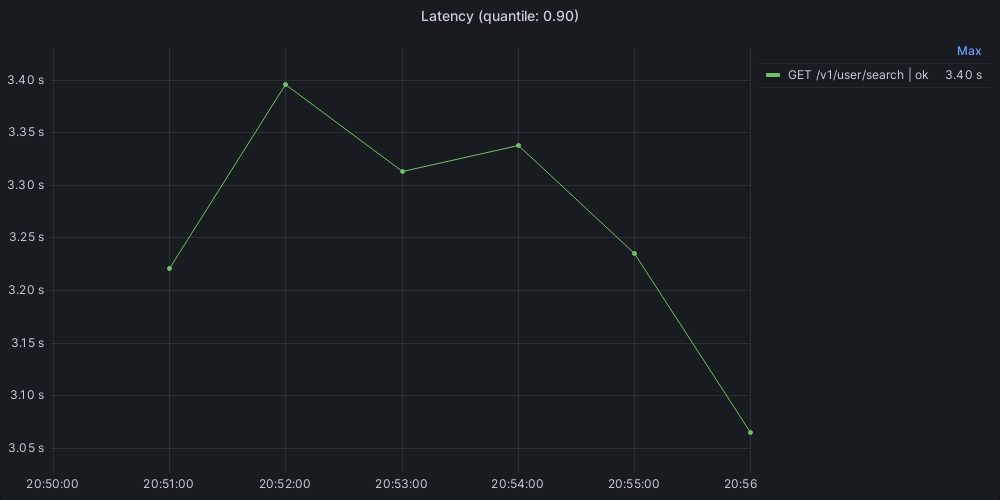
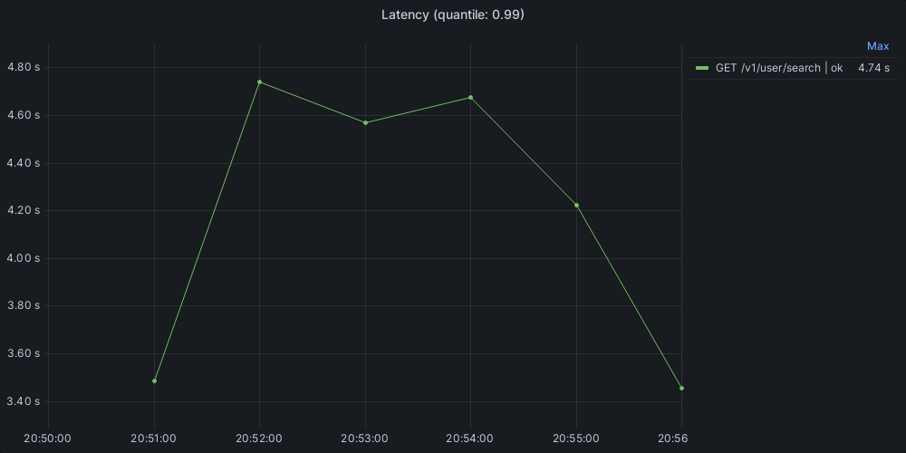
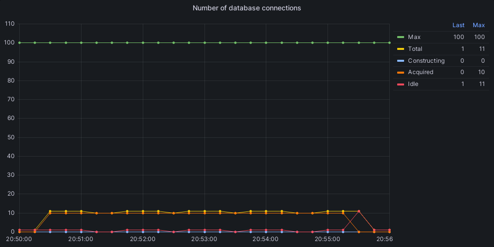
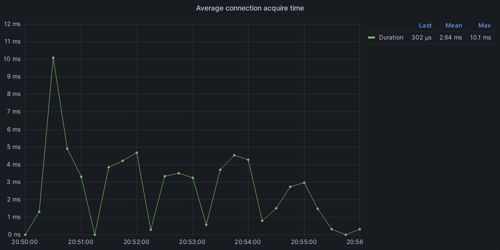
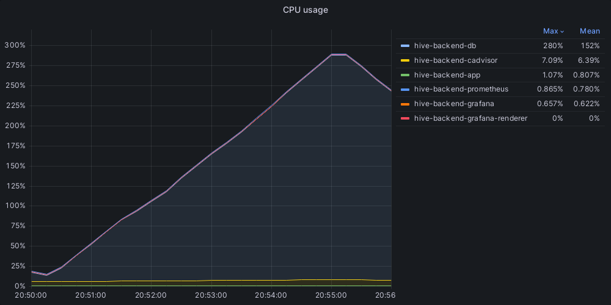

Запустил тест на 100 одновременных пользователей:
```
  scenarios: (100.00%) 1 scenario, 100 max VUs, 5m30s max duration (incl. graceful stop):
           * default: 100 looping VUs for 5m0s (gracefulStop: 30s)

     ✗ status was 200
      ↳  45% — ✓ 5798 / ✗ 6823

     █ setup

     checks.........................: 45.93% ✓ 5798      ✗ 6823 
     data_received..................: 3.4 MB 11 kB/s
     data_sent......................: 2.3 MB 7.4 kB/s
     http_req_blocked...............: avg=1.35ms   min=2.23µs  med=5.86µs   max=777.32ms p(90)=7.05µs   p(95)=8.01µs  
     http_req_connecting............: avg=1.17ms   min=0s      med=0s       max=632.41ms p(90)=0s       p(95)=0s      
     http_req_duration..............: avg=2.37s    min=3.79ms  med=379.07ms max=5.36s    p(90)=5.01s    p(95)=5.02s   
       { expected_response:true }...: avg=5.01s    min=3.19s   med=5s       max=5.36s    p(90)=5.03s    p(95)=5.06s   
     http_req_failed................: 54.06% ✓ 6823      ✗ 5798 
     http_req_receiving.............: avg=313.73µs min=25.34µs med=77.19µs  max=159.59ms p(90)=106.45µs p(95)=130.39µs
     http_req_sending...............: avg=454.52µs min=12.23µs med=27.55µs  max=330.03ms p(90)=52.82µs  p(95)=69.58µs 
     http_req_tls_handshaking.......: avg=0s       min=0s      med=0s       max=0s       p(90)=0s       p(95)=0s      
     http_req_waiting...............: avg=2.37s    min=3.63ms  med=378.82ms max=5.26s    p(90)=5.01s    p(95)=5.02s   
     http_reqs......................: 12621  41.546808/s
     iteration_duration.............: avg=2.38s    min=26.63µs med=384.47ms max=5.91s    p(90)=5.02s    p(95)=5.04s   
     iterations.....................: 12621  41.546808/s
     vus............................: 1      min=1       max=100
     vus_max........................: 100    min=100     max=100

running (5m03.8s), 000/100 VUs, 12621 complete and 0 interrupted iterations
default ✓ [======================================] 100 VUs  5m0s
```
Графики:

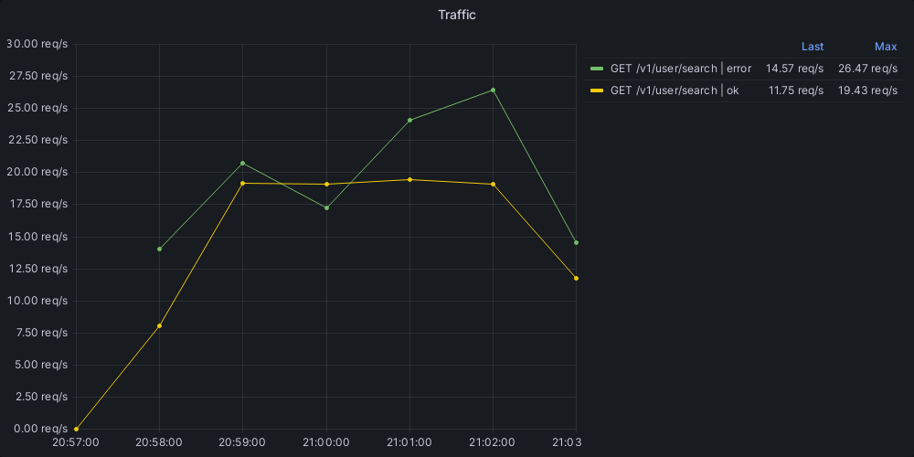
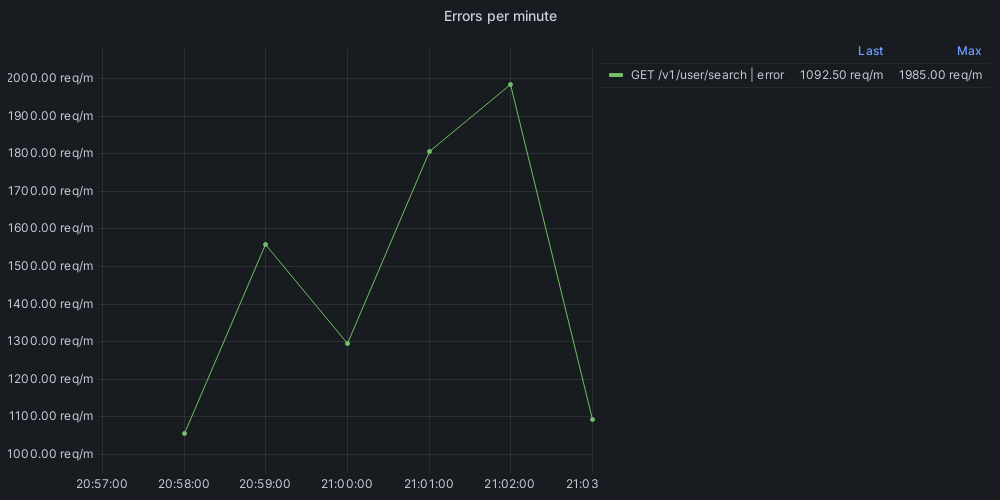
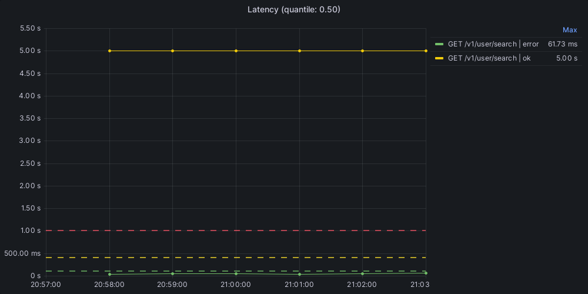
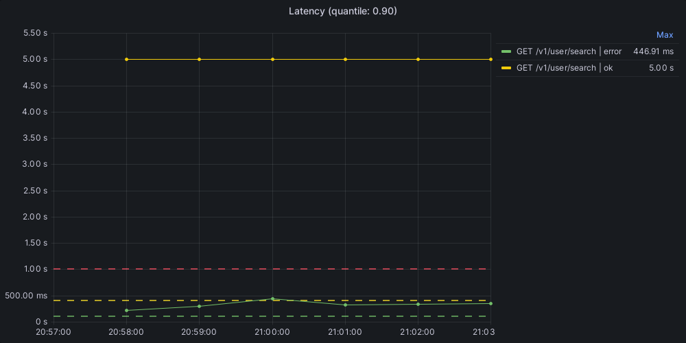
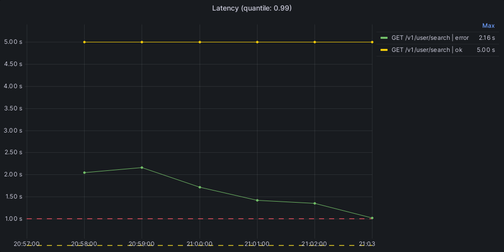
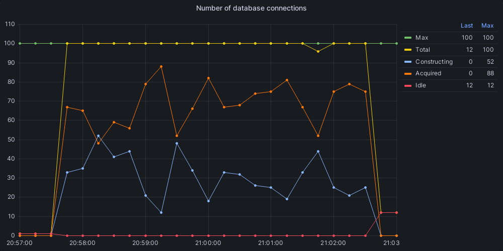
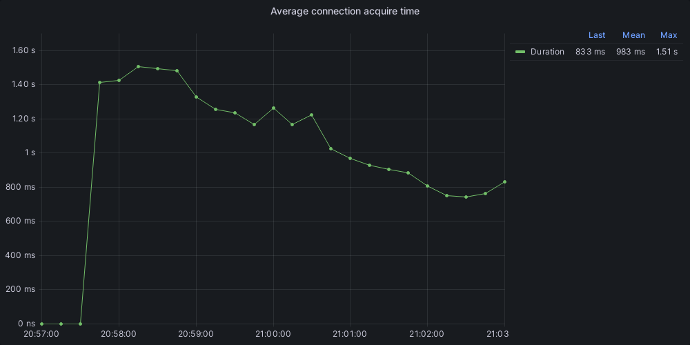
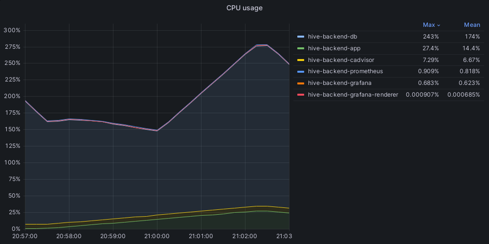

Попробовал добавить индекс для двух полей.\
Добавил SQL-скрипт в миграции, чтобы при следующем старте Docker-контейнера эти изменения применились.\
