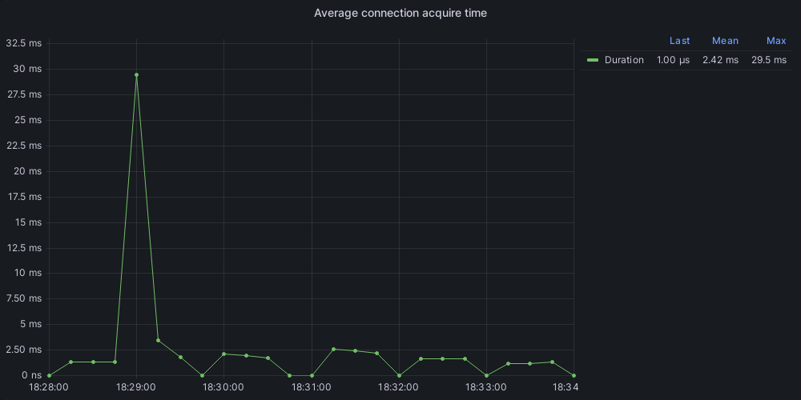
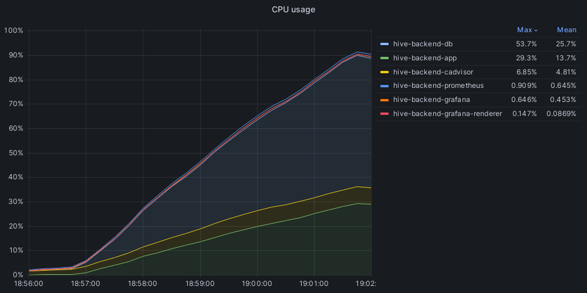

В проекте используется [pgxpool](https://pkg.go.dev/github.com/jackc/pgx/v5/pgxpool), это защищенный от параллелизма пул соединений для pgx, библиотеки для работы с PostgreSQL.
Установил максимальное количество соединений в пуле равным 100.
Запрос для нагрузочного теста выглядит следующим образом:
```
curl --location 'localhost:8080/v1/user/search?first_name=%D0%9E%D0%BB%D0%B5%D0%B3&last_name=%D0%A8%D0%BE%D0%BA%D0%B8%D0%BD&limit=1' \
--data ''
```
Этот запрос вызывает базу с таким запросом:
```
select
	id,
	email,
	password_hash,
	city_id,
	first_name,
	last_name,
	birthdate,
	gender,
	interests
from
	users
where
	first_name like 'Олег%'
	and last_name like 'Шокин%'
order by
	id asc
limit 2
```
PostreSQL составляет такой план запроса:
```
QUERY PLAN                                                                                                                        |
----------------------------------------------------------------------------------------------------------------------------------+
Limit  (cost=30616.77..30616.77 rows=1 width=154) (actual time=171.005..181.916 rows=0 loops=1)                                   |
  ->  Sort  (cost=30616.77..30616.77 rows=1 width=154) (actual time=171.003..181.913 rows=0 loops=1)                              |
        Sort Key: id                                                                                                              |
        Sort Method: quicksort  Memory: 25kB                                                                                      |
        ->  Gather  (cost=1000.00..30616.76 rows=1 width=154) (actual time=170.981..181.891 rows=0 loops=1)                       |
              Workers Planned: 2                                                                                                  |
              Workers Launched: 2                                                                                                 |
              ->  Parallel Seq Scan on users  (cost=0.00..29616.66 rows=1 width=154) (actual time=152.721..152.722 rows=0 loops=3)|
                    Filter: (((first_name)::text ~~ 'Олег%'::text) AND ((last_name)::text ~~ 'Шокин%'::text))                     |
                    Rows Removed by Filter: 333333                                                                                |
Planning Time: 0.274 ms                                                                                                           |
Execution Time: 182.041 ms                                                                                                        |
```
Если я правильно понял план запроса: \
Запущено 2 потока, который просканировали таблицу по частям, в каждой из которых откнинули по 333 333 записей. \
Это неудивительно, ведь индексов по колонкам first_name и last_name сейчас нет.\
\
Запустил нагрузочный тест на 10 одновременных запросов в течение 5 минут:
```
  scenarios: (100.00%) 1 scenario, 10 max VUs, 5m30s max duration (incl. graceful stop):
           * default: 10 looping VUs for 5m0s (gracefulStop: 30s)

     ✓ status was 200

     █ setup

     checks.........................: 100.00% ✓ 1453     ✗ 0   
     data_received..................: 222 kB  740 B/s
     data_sent......................: 260 kB  865 B/s
     http_req_blocked...............: avg=39.8µs  min=3.8µs    med=5.58µs  max=11.32ms p(90)=6.71µs   p(95)=7.73µs  
     http_req_connecting............: avg=24.83µs min=0s       med=0s      max=11.17ms p(90)=0s       p(95)=0s      
     http_req_duration..............: avg=2.06s   min=462.1ms  med=2.05s   max=4.6s    p(90)=2.99s    p(95)=3.37s   
       { expected_response:true }...: avg=2.06s   min=462.1ms  med=2.05s   max=4.6s    p(90)=2.99s    p(95)=3.37s   
     http_req_failed................: 0.00%   ✓ 0        ✗ 1453
     http_req_receiving.............: avg=84.42µs min=32.5µs   med=77.02µs max=1.39ms  p(90)=104.52µs p(95)=119.57µs
     http_req_sending...............: avg=40.16µs min=18.73µs  med=25.58µs max=5.4ms   p(90)=52.77µs  p(95)=67.71µs 
     http_req_tls_handshaking.......: avg=0s      min=0s       med=0s      max=0s      p(90)=0s       p(95)=0s      
     http_req_waiting...............: avg=2.06s   min=462.04ms med=2.05s   max=4.6s    p(90)=2.99s    p(95)=3.37s   
     http_reqs......................: 1453    4.834108/s
     iteration_duration.............: avg=2.06s   min=17.53µs  med=2.05s   max=4.6s    p(90)=2.99s    p(95)=3.38s   
     iterations.....................: 1453    4.834108/s
     vus............................: 10      min=10     max=10
     vus_max........................: 10      min=10     max=10

running (5m00.6s), 00/10 VUs, 1453 complete and 0 interrupted iterations
default ✓ [======================================] 10 VUs  5m0s
```
Графики:


Запустил нагрузочный тест на 100 одновременных запросов в течение 5 минут:
```
  scenarios: (100.00%) 1 scenario, 100 max VUs, 5m30s max duration (incl. graceful stop):
           * default: 100 looping VUs for 5m0s (gracefulStop: 30s)

     ✗ status was 200
      ↳  45% — ✓ 5798 / ✗ 6823

     █ setup

     checks.........................: 45.93% ✓ 5798      ✗ 6823 
     data_received..................: 3.4 MB 11 kB/s
     data_sent......................: 2.3 MB 7.4 kB/s
     http_req_blocked...............: avg=1.35ms   min=2.23µs  med=5.86µs   max=777.32ms p(90)=7.05µs   p(95)=8.01µs  
     http_req_connecting............: avg=1.17ms   min=0s      med=0s       max=632.41ms p(90)=0s       p(95)=0s      
     http_req_duration..............: avg=2.37s    min=3.79ms  med=379.07ms max=5.36s    p(90)=5.01s    p(95)=5.02s   
       { expected_response:true }...: avg=5.01s    min=3.19s   med=5s       max=5.36s    p(90)=5.03s    p(95)=5.06s   
     http_req_failed................: 54.06% ✓ 6823      ✗ 5798 
     http_req_receiving.............: avg=313.73µs min=25.34µs med=77.19µs  max=159.59ms p(90)=106.45µs p(95)=130.39µs
     http_req_sending...............: avg=454.52µs min=12.23µs med=27.55µs  max=330.03ms p(90)=52.82µs  p(95)=69.58µs 
     http_req_tls_handshaking.......: avg=0s       min=0s      med=0s       max=0s       p(90)=0s       p(95)=0s      
     http_req_waiting...............: avg=2.37s    min=3.63ms  med=378.82ms max=5.26s    p(90)=5.01s    p(95)=5.02s   
     http_reqs......................: 12621  41.546808/s
     iteration_duration.............: avg=2.38s    min=26.63µs med=384.47ms max=5.91s    p(90)=5.02s    p(95)=5.04s   
     iterations.....................: 12621  41.546808/s
     vus............................: 1      min=1       max=100
     vus_max........................: 100    min=100     max=100

running (5m03.8s), 000/100 VUs, 12621 complete and 0 interrupted iterations
default ✓ [======================================] 100 VUs  5m0s
```
Графики:


Как видно из результатов, уже при 100 пользователях почти половина запросов падает с ошибкой.\
Запускал тест еще на 1000 одновременных запросов, но очевидно все очень плохо - 5% успешных запросов.\
Чтобы исправить ситуацию, я попробовал добавить составной индекс для двух полей, по которым идет поиск.\
Сначала добавил индекс через DBeaver:
```
CREATE INDEX users_first_name_idx ON users USING btree (first_name, last_name);
```
Выбрал составной индекс, поскольку в запросе, которые используется в API идет одновременный поиск по имени и фамилии.\
Почему именно b-tree?\
Потому что, b-tree индекс представляет из себя дерево, где узел-родитель хранит букву в поисковом запросе и следующую букву в своих узлах.\
Таким образом имеем логарифмическую сложность поиска, что очень хорошо подходит под запросы вида `LIKE 'something%'`.\
Когда я добавил составной индекс, результаты меня неприятно удивили.\
Индекс не работал, планировщик PostgreSQL упорно выбирал parallel sequential scan.\
После пары часов мучений - я запускал psql, отключал индекс, добавил еще 5 млн анкет, делал `vacuum full`.\
Я решил добавить индекс через psql и все заработало.\
Как оказалось, DBeaver показывал, что использовал `operator class` `text_pattern_ops`, по факту - нет.\
То есть конечный запрос на рабочий индекс выглядел вот так:
```
CREATE INDEX users_first_name_idx ON users USING btree (first_name text_pattern_ops, last_name text_pattern_ops);
```
Напишите, пожалуйста, об этом предупреждение в материалах ДЗ, чтобы другие люди не тратили столько же драгоценного времени, что и я.\
Теперь запрос выполняется быстрее:
```
QUERY PLAN                                                                                                                                                                                       |
-------------------------------------------------------------------------------------------------------------------------------------------------------------------------------------------------+
Limit  (cost=224.44..224.45 rows=1 width=154) (actual time=0.096..0.097 rows=0 loops=1)                                                                                                          |
  ->  Sort  (cost=224.44..224.45 rows=1 width=154) (actual time=0.094..0.095 rows=0 loops=1)                                                                                                     |
        Sort Key: id                                                                                                                                                                             |
        Sort Method: quicksort  Memory: 25kB                                                                                                                                                     |
        ->  Index Scan using users_first_name_idx on users  (cost=0.42..224.44 rows=1 width=154) (actual time=0.089..0.090 rows=0 loops=1)                                                       |
              Index Cond: (((first_name)::text ~>=~ 'Олег'::text) AND ((first_name)::text ~<~ 'Олед'::text) AND ((last_name)::text ~>=~ 'Шокин'::text) AND ((last_name)::text ~<~ 'Шокио'::text))|
              Filter: (((first_name)::text ~~ 'Олег%'::text) AND ((last_name)::text ~~ 'Шокин%'::text))                                                                                          |
Planning Time: 0.526 ms                                                                                                                                                                          |
Execution Time: 0.163 ms                                                                                                                                                                         |
```
Теперь, как мы видим используется вновь созданный индекс.\
Переходим к самому интересному:\
Запустил нагрузочный тест на 10 одновременных запросов в течение 5 минут:
```
  scenarios: (100.00%) 1 scenario, 10 max VUs, 5m30s max duration (incl. graceful stop):
           * default: 10 looping VUs for 5m0s (gracefulStop: 30s)

     ✓ status was 200

     █ setup

     checks.........................: 100.00% ✓ 152497     ✗ 0     
     data_received..................: 23 MB   78 kB/s
     data_sent......................: 27 MB   91 kB/s
     http_req_blocked...............: avg=14.38µs  min=1.92µs  med=5.08µs max=42.23ms  p(90)=6.66µs   p(95)=7.49µs  
     http_req_connecting............: avg=551ns    min=0s      med=0s     max=17.84ms  p(90)=0s       p(95)=0s      
     http_req_duration..............: avg=11.95ms  min=1.28ms  med=9.37ms max=248.35ms p(90)=23.92ms  p(95)=30.59ms 
       { expected_response:true }...: avg=11.95ms  min=1.28ms  med=9.37ms max=248.35ms p(90)=23.92ms  p(95)=30.59ms 
     http_req_failed................: 0.00%   ✓ 0          ✗ 152497
     http_req_receiving.............: avg=414.63µs min=20.09µs med=49.3µs max=100.25ms p(90)=221.68µs p(95)=1.26ms  
     http_req_sending...............: avg=296.69µs min=10.11µs med=23µs   max=114.16ms p(90)=39.87µs  p(95)=101.62µs
     http_req_tls_handshaking.......: avg=0s       min=0s      med=0s     max=0s       p(90)=0s       p(95)=0s      
     http_req_waiting...............: avg=11.23ms  min=1.21ms  med=8.85ms max=243.06ms p(90)=22.54ms  p(95)=28.71ms 
     http_reqs......................: 152497  508.304475/s
     iteration_duration.............: avg=19.62ms  min=19.97µs med=15.5ms max=255.62ms p(90)=37.13ms  p(95)=48.25ms 
     iterations.....................: 152497  508.304475/s
     vus............................: 10      min=10       max=10  
     vus_max........................: 10      min=10       max=10  

started: Wed Apr 26 2023 18:06:24 GMT+0300 (MSK)
ended: Wed Apr 26 2023 18:11:25 GMT+0300 (MSK)

running (5m00.0s), 00/10 VUs, 152497 complete and 0 interrupted iterations
default ✓ [======================================] 10 VUs  5m0s
```
152497 против 1453, в 104 раза быстрее. Неслабо!\
Графики:


Затем запустил нагрузочный тест на 100 одновременных запросов в течение 5 минут:
```
  scenarios: (100.00%) 1 scenario, 100 max VUs, 5m30s max duration (incl. graceful stop):
           * default: 100 looping VUs for 5m0s (gracefulStop: 30s)

     ✗ status was 200
      ↳  99% — ✓ 186033 / ✗ 20

     █ setup

     checks.........................: 99.98% ✓ 186033     ✗ 20    
     data_received..................: 29 MB  95 kB/s
     data_sent......................: 33 MB  111 kB/s
     http_req_blocked...............: avg=250.42µs min=1.95µs  med=4.95µs   max=479.04ms p(90)=6.73µs   p(95)=7.54µs  
     http_req_connecting............: avg=211.63µs min=0s      med=0s       max=478.96ms p(90)=0s       p(95)=0s      
     http_req_duration..............: avg=141.23ms min=1.53ms  med=124.33ms max=1.78s    p(90)=220.13ms p(95)=268.01ms
       { expected_response:true }...: avg=141.15ms min=1.53ms  med=124.33ms max=1.78s    p(90)=220.08ms p(95)=267.87ms
     http_req_failed................: 0.01%  ✓ 20         ✗ 186033
     http_req_receiving.............: avg=2.98ms   min=19.46µs med=45.54µs  max=851.22ms p(90)=149.2µs  p(95)=992.9µs 
     http_req_sending...............: avg=2.27ms   min=9.46µs  med=22.26µs  max=719.1ms  p(90)=39.67µs  p(95)=205.56µs
     http_req_tls_handshaking.......: avg=0s       min=0s      med=0s       max=0s       p(90)=0s       p(95)=0s      
     http_req_waiting...............: avg=135.98ms min=1.43ms  med=121.93ms max=1.76s    p(90)=209.35ms p(95)=249.06ms
     http_reqs......................: 186053 620.110285/s
     iteration_duration.............: avg=160.64ms min=21.25µs med=133.58ms max=2.57s    p(90)=267.82ms p(95)=340.88ms
     iterations.....................: 186053 620.110285/s
     vus............................: 100    min=100      max=100 
     vus_max........................: 100    min=100      max=100 

running (5m00.0s), 000/100 VUs, 186053 complete and 0 interrupted iterations
default ✓ [======================================] 100 VUs  5m0s
```
Тут тоже все гораздо лучше - 20 ошибочных запросов из 186053 запросов вместо 6823 из 12621 ранее.\
Графики:





Раз ошибок не так много, можно запустить тест на 1000 одновременных пользователей:
```
  scenarios: (100.00%) 1 scenario, 1000 max VUs, 5m30s max duration (incl. graceful stop):
           * default: 1000 looping VUs for 5m0s (gracefulStop: 30s)

WARN[0226] Request Failed                                error="Get \"http://localhost:8080/v1/user/search?first_name=%D0%9E%D0%BB%D0%B5%D0%B3&last_name=%D0%A8%D0%BE%D0%BA%D0%B8%D0%BD&limit=1\": EOF"
WARN[0226] Request Failed                                error="Get \"http://localhost:8080/v1/user/search?first_name=%D0%9E%D0%BB%D0%B5%D0%B3&last_name=%D0%A8%D0%BE%D0%BA%D0%B8%D0%BD&limit=1\": EOF"
     ✗ status was 200
      ↳  99% — ✓ 164766 / ✗ 2

     █ setup

     checks.........................: 99.99% ✓ 164766     ✗ 2     
     data_received..................: 25 MB  84 kB/s
     data_sent......................: 30 MB  98 kB/s
     http_req_blocked...............: avg=5.43ms  min=2µs     med=5.17µs  max=3.79s  p(90)=7.03µs  p(95)=8.51µs  
     http_req_connecting............: avg=5.03ms  min=0s      med=0s      max=3.79s  p(90)=0s      p(95)=0s      
     http_req_duration..............: avg=1.24s   min=1.61ms  med=1.18s   max=7.64s  p(90)=2.09s   p(95)=2.48s   
       { expected_response:true }...: avg=1.24s   min=1.61ms  med=1.18s   max=7.64s  p(90)=2.09s   p(95)=2.48s   
     http_req_failed................: 0.00%  ✓ 2          ✗ 164766
     http_req_receiving.............: avg=10.74ms min=0s      med=42.86µs max=3.74s  p(90)=119.9µs p(95)=445.11µs
     http_req_sending...............: avg=16.89ms min=9.54µs  med=23.79µs max=4.49s  p(90)=43.49µs p(95)=315.53µs
     http_req_tls_handshaking.......: avg=0s      min=0s      med=0s      max=0s     p(90)=0s      p(95)=0s      
     http_req_waiting...............: avg=1.22s   min=25.13µs med=1.16s   max=5.95s  p(90)=2.04s   p(95)=2.39s   
     http_reqs......................: 164768 549.058091/s
     iteration_duration.............: avg=1.75s   min=19.26µs med=1.54s   max=11.51s p(90)=2.93s   p(95)=3.49s   
     iterations.....................: 164768 549.058091/s
     vus............................: 1000   min=0        max=1000
     vus_max........................: 1000   min=300      max=1000

running (5m00.1s), 0000/1000 VUs, 164768 complete and 0 interrupted iterations
default ✓ [======================================] 1000 VUs  5m0s
```
Тут всего 2 ошибки I/O, похоже что ноут не тянет 1000 RPS :)\
Графики:



\
\
**Вывод**:\
Правильно подобранный индекс может существенно увеличить производительность даже монолитного приложения.