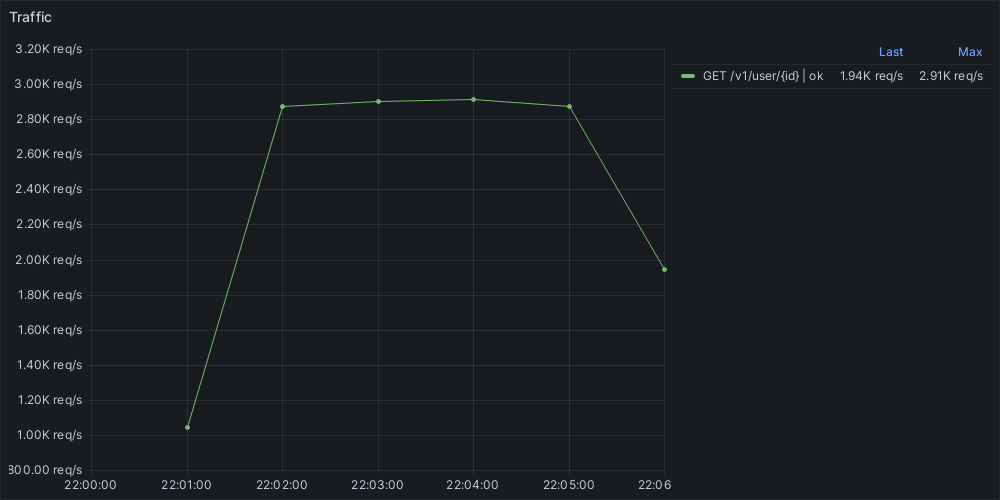
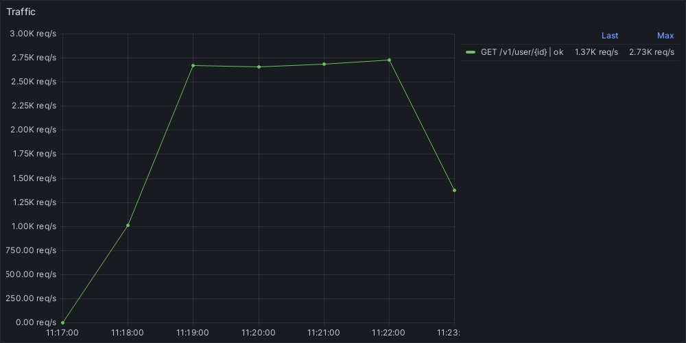
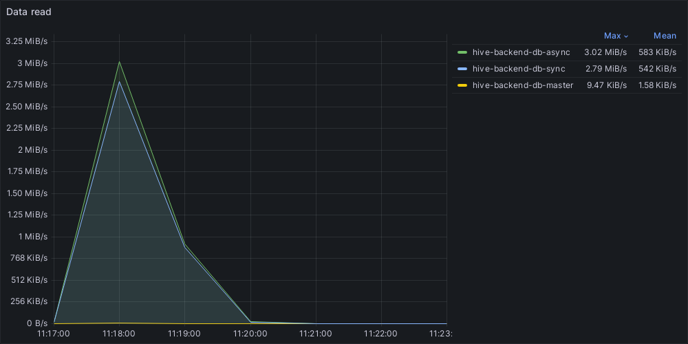
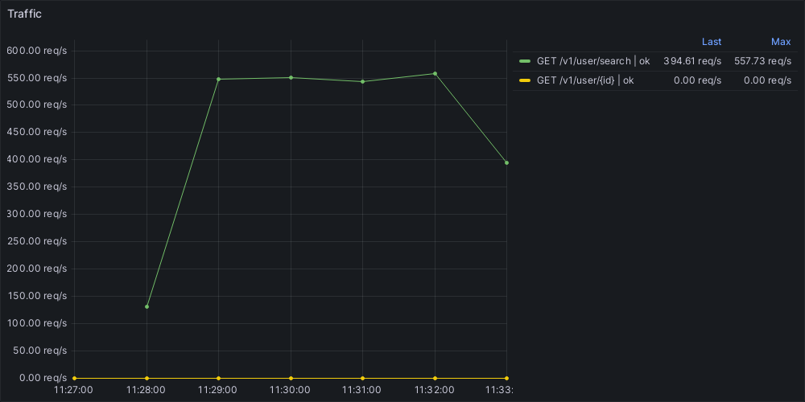

1. Настраиваем асинхронную репликацию.\
\
**Результат**:\
Доработал `docker-compose.yaml`:\
Переименовал контейнер мастер-БД в `hive-backend-db-master`, а контейнеры реплик `hive-backend-db-sync` и `hive-backend-db-async`.\
Добавил сразу 2 контейнера реплик, чтобы потом не допиливать приложение и структуру с кластером подключений к каждой БД.\
Пока обе реплики асинхронные (потом `hive-backend-db-sync` станет синхронной).\
Добавил папки с настройками для трех баз.\
Дописал в коде работу с 3мя инстансами баз.
В папки с настройками для каждой реплики положил `init.sql`, который добавляет пользователя для репликации и `init-replica.sh`, добавляющий `standby.signal` в папку с данными реплики.\
Для всех трех баз настроил `postgresql.conf` и `pg_hba.conf`.\
Настройки лежат в `configs/postgresql/{db-role}`, где `db-role` - роль БД в кластере.\
Для `hive-backend-db-master` задал максимальный размер `pg_wal` равным 1 Гб, чтобы реплики успевали подхватить данные.\
Написал `Makefile` target'ы для реплик:
- `sync-replicas` для быстрого копирования master в реплики.
- `stop-replicas` для остановки реплик и смены владельца папок с данными (чтобы Go не выдавал ошибку о недоступности данных).
- `clean-replicas` для остановки реплик и удаления папок с данными.\
Поскольку настраиваем асинхронную репликацию, то в `postgresql.conf` для `hive-backend-db-master` я выключил синхронные коммиты (`synchronous_commit = off`).\
Добавил метрики для разных баз PostgreSQL.

2. Выбираем 2 запроса на чтение ([/user/get/{id}](https://github.com/OtusTeam/highload/blob/master/homework/openapi.json#L129 "/user/get/{id}") и [/user/search](https://github.com/OtusTeam/highload/blob/master/homework/openapi.json#L165 "/user/search") из [спецификации](https://github.com/OtusTeam/highload/blob/master/homework/openapi.json "спецификации")) и переносим их на чтение со слейва.\
\
**Результат**:\
Перевел запросы на Round Robin чтение из одной из двух реплик.

3. Делаем нагрузочный тест по методам ([/user/get/{id}](https://github.com/OtusTeam/highload/blob/master/homework/openapi.json#L129 "/user/get/{id}") и [/user/search](https://github.com/OtusTeam/highload/blob/master/homework/openapi.json#L165 "/user/search") из [спецификации](https://github.com/OtusTeam/highload/blob/master/homework/openapi.json "спецификации")), которые перевели на слейв до и после репликации. Замеряем нагрузку мастера (CPU, la, disc usage, memory usage).\
\
**Результат**:\
Написал нагрузочный тест для метода `/v1/user/{id}`, тест для `/v1/user/search` уже был.\
Тесты находятся в папке `test`.\
Сначала поменял обратно в методах репозитория чтение из `hive-backend-db-master`.
- Запустил нагрузочный тест на 1000 одновременных пользователей для метода `/v1/user/{id}`:
```
  scenarios: (100.00%) 1 scenario, 1000 max VUs, 5m30s max duration (incl. graceful stop):
           * default: 1000 looping VUs for 5m0s (gracefulStop: 30s)

     ✓ status was 200

     █ setup

     checks.........................: 100.00% ✓ 856449      ✗ 0     
     data_received..................: 277 MB  923 kB/s
     data_sent......................: 80 MB   268 kB/s
     http_req_blocked...............: avg=89.99µs  min=1.39µs  med=2.91µs   max=524.55ms p(90)=4.85µs   p(95)=6.1µs   
     http_req_connecting............: avg=56.39µs  min=0s      med=0s       max=337.36ms p(90)=0s       p(95)=0s      
     http_req_duration..............: avg=336.1ms  min=1.87ms  med=311.17ms max=3.02s    p(90)=481.86ms p(95)=580.42ms
       { expected_response:true }...: avg=336.1ms  min=1.87ms  med=311.17ms max=3.02s    p(90)=481.86ms p(95)=580.42ms
     http_req_failed................: 0.00%   ✓ 0           ✗ 856449
     http_req_receiving.............: avg=746.8µs  min=18.5µs  med=34.42µs  max=1.5s     p(90)=67.11µs  p(95)=300.5µs 
     http_req_sending...............: avg=323.67µs min=7.24µs  med=14.13µs  max=893.92ms p(90)=27.39µs  p(95)=44.86µs 
     http_req_tls_handshaking.......: avg=0s       min=0s      med=0s       max=0s       p(90)=0s       p(95)=0s      
     http_req_waiting...............: avg=335.03ms min=1.78ms  med=310.52ms max=3.02s    p(90)=479.96ms p(95)=577.29ms
     http_reqs......................: 856449  2853.000732/s
     iteration_duration.............: avg=349.49ms min=33.37µs med=318.16ms max=3.02s    p(90)=506.68ms p(95)=619.52ms
     iterations.....................: 856449  2853.000732/s
     vus............................: 1000    min=0         max=1000
     vus_max........................: 1000    min=820       max=1000

running (5m00.2s), 0000/1000 VUs, 856449 complete and 0 interrupted iterations
default ✓ [======================================] 1000 VUs  5m0s
```
Графики:\
\



- Запустил нагрузочный тест на 1000 одновременных пользователей для метода `/v1/user/search`:
```
  scenarios: (100.00%) 1 scenario, 1000 max VUs, 5m30s max duration (incl. graceful stop):
           * default: 1000 looping VUs for 5m0s (gracefulStop: 30s)

     ✓ status was 200

     █ setup

     checks.........................: 100.00% ✓ 166040     ✗ 0     
     data_received..................: 25 MB   85 kB/s
     data_sent......................: 30 MB   99 kB/s
     http_req_blocked...............: avg=9.21ms  min=2.05µs  med=4.98µs  max=4.05s p(90)=6.94µs  p(95)=9.42µs  
     http_req_connecting............: avg=8.82ms  min=0s      med=0s      max=4.05s p(90)=0s      p(95)=0s      
     http_req_duration..............: avg=1.16s   min=1.57ms  med=1.12s   max=6.76s p(90)=1.92s   p(95)=2.23s   
       { expected_response:true }...: avg=1.16s   min=1.57ms  med=1.12s   max=6.76s p(90)=1.92s   p(95)=2.23s   
     http_req_failed................: 0.00%   ✓ 0          ✗ 166040
     http_req_receiving.............: avg=9.27ms  min=15.96µs med=43.95µs max=5.03s p(90)=130.1µs p(95)=453.28µs
     http_req_sending...............: avg=12.07ms min=11.08µs med=24.61µs max=4.03s p(90)=43.14µs p(95)=128.89µs
     http_req_tls_handshaking.......: avg=0s      min=0s      med=0s      max=0s    p(90)=0s      p(95)=0s      
     http_req_waiting...............: avg=1.14s   min=1.48ms  med=1.11s   max=6.71s p(90)=1.88s   p(95)=2.17s   
     http_reqs......................: 166040  553.314527/s
     iteration_duration.............: avg=1.75s   min=16.45µs med=1.54s   max=9.39s p(90)=2.98s   p(95)=3.57s   
     iterations.....................: 166040  553.314527/s
     vus............................: 1000    min=0        max=1000
     vus_max........................: 1000    min=329      max=1000

running (5m00.1s), 0000/1000 VUs, 166040 complete and 0 interrupted iterations
default ✓ [======================================] 1000 VUs  5m0s
```
Графики:\
\


\
\
Вернул обратно чтение с каждой из реплик по Round Robin.
- Запустил нагрузочный тест на 1000 одновременных пользователей для метода `/v1/user/{id}`:
```
  scenarios: (100.00%) 1 scenario, 1000 max VUs, 5m30s max duration (incl. graceful stop):
           * default: 1000 looping VUs for 5m0s (gracefulStop: 30s)

     ✓ status was 200

     █ setup

     checks.........................: 100.00% ✓ 800287      ✗ 0     
     data_received..................: 259 MB  862 kB/s
     data_sent......................: 75 MB   250 kB/s
     http_req_blocked...............: avg=181.37µs min=1.51µs   med=2.95µs   max=1.3s     p(90)=4.95µs   p(95)=6.14µs  
     http_req_connecting............: avg=111.77µs min=0s       med=0s       max=622.76ms p(90)=0s       p(95)=0s      
     http_req_duration..............: avg=363.56ms min=721.65µs med=328.03ms max=3.46s    p(90)=589.44ms p(95)=700.47ms
       { expected_response:true }...: avg=363.56ms min=721.65µs med=328.03ms max=3.46s    p(90)=589.44ms p(95)=700.47ms
     http_req_failed................: 0.00%   ✓ 0           ✗ 800287
     http_req_receiving.............: avg=707.1µs  min=13.26µs  med=34.96µs  max=1.59s    p(90)=68.92µs  p(95)=316.38µs
     http_req_sending...............: avg=301.38µs min=8.58µs   med=14.25µs  max=1.5s     p(90)=27.67µs  p(95)=46.35µs 
     http_req_tls_handshaking.......: avg=0s       min=0s       med=0s       max=0s       p(90)=0s       p(95)=0s      
     http_req_waiting...............: avg=362.55ms min=682.54µs med=327.28ms max=3.43s    p(90)=587.87ms p(95)=697.95ms
     http_reqs......................: 800287  2665.425636/s
     iteration_duration.............: avg=374.18ms min=35.47µs  med=336.52ms max=3.73s    p(90)=604.62ms p(95)=724.87ms
     iterations.....................: 800287  2665.425636/s
     vus............................: 1000    min=0         max=1000
     vus_max........................: 1000    min=884       max=1000

running (5m00.2s), 0000/1000 VUs, 800287 complete and 0 interrupted iterations
default ✓ [======================================] 1000 VUs  5m0s
```
Графики:\
\





\
`hive-backend-db-sync`:\

\
`hive-backend-db-async`:\


- Запустил нагрузочный тест на 1000 одновременных пользователей для метода `/v1/user/search`:
```
  scenarios: (100.00%) 1 scenario, 1000 max VUs, 5m30s max duration (incl. graceful stop):
           * default: 1000 looping VUs for 5m0s (gracefulStop: 30s)

     ✓ status was 200

     █ setup

     checks.........................: 100.00% ✓ 164183     ✗ 0     
     data_received..................: 25 MB   84 kB/s
     data_sent......................: 29 MB   98 kB/s
     http_req_blocked...............: avg=8.35ms  min=2.04µs  med=5.06µs  max=4.16s  p(90)=7.01µs  p(95)=8.96µs  
     http_req_connecting............: avg=7.8ms   min=0s      med=0s      max=3.27s  p(90)=0s      p(95)=0s      
     http_req_duration..............: avg=1.24s   min=1.45ms  med=1.16s   max=7.92s  p(90)=2.08s   p(95)=2.39s   
       { expected_response:true }...: avg=1.24s   min=1.45ms  med=1.16s   max=7.92s  p(90)=2.08s   p(95)=2.39s   
     http_req_failed................: 0.00%   ✓ 0          ✗ 164183
     http_req_receiving.............: avg=16.05ms min=18.21µs med=43.44µs max=6.13s  p(90)=94.76µs p(95)=413.06µs
     http_req_sending...............: avg=17.09ms min=10.75µs med=24.74µs max=5.3s   p(90)=43.92µs p(95)=223.47µs
     http_req_tls_handshaking.......: avg=0s      min=0s      med=0s      max=0s     p(90)=0s      p(95)=0s      
     http_req_waiting...............: avg=1.2s    min=1.33ms  med=1.15s   max=6.02s  p(90)=2.02s   p(95)=2.32s   
     http_reqs......................: 164183  547.078023/s
     iteration_duration.............: avg=1.77s   min=37.35µs med=1.55s   max=10.13s p(90)=3s      p(95)=3.54s   
     iterations.....................: 164183  547.078023/s
     vus............................: 1000    min=0        max=1000
     vus_max........................: 1000    min=315      max=1000

running (5m00.1s), 0000/1000 VUs, 164183 complete and 0 interrupted iterations
default ✓ [======================================] 1000 VUs  5m0s
```
Графики:\
\



\
`hive-backend-db-sync`:\

\
`hive-backend-db-async`:\


\
\
**Вывод**:\
Похоже, что переключатель целевой БД в алгоритме Round Robin отъедает часть времени в процессе.\
Получение случайного пользователя до переключения на реплики успело выполниться 856 449 раз, то есть 2 853 запросов / сек.\
После переключения на реплики - 800 287 раз, то есть 2 665 запросов / сек.\
Аналогичная ситуация и с методом `/v1/user/search`:\
Поиск несуществующего пользователя до переключения успел выполниться 166 040 раз, то есть 553 запросов / сек.\
После переключения на реплики - 164 183 раз, то есть 547 запросов / сек.\
Думаю, что переключение между репликами стоит переносить на внешний балансировщик, а не держать примитив синхронизации в коде.

4. Настроить 2 слейва и 1 мастер.\
\
**Результат**:\
Уже сделал вначале.

5. Включить потоковую репликацию.\
\
**Результат**:\
Из того, что я вижу она и так работает.
```
select
	pid,
	usename,
	application_name,
	client_addr,
	client_port,
	backend_start,
	state,
	sync_state
from
	pg_stat_replication;
```
выдает следующее
```
pid |usename   |application_name|client_addr|client_port|backend_start                |state    |sync_state|
----+----------+----------------+-----------+-----------+-----------------------------+---------+----------+
6027|replicator|db-async        |172.18.0.2 |      50392|2023-05-14 10:21:17.936 +0300|streaming|async     |
6026|replicator|db-sync         |172.18.0.4 |      44926|2023-05-14 10:21:17.935 +0300|streaming|async     |
```

6. (Опционально) воспользоваться одним из кластерных расширения Postgres.\
\
**Результат**:\
А в каком смысле воспользоваться? Что нужно было сделать?

7. Настроить кворумную синхронную репликацию.\
\
**Результат**:\
Добавил запись в `postgresql.conf` в `hive-db-master`:
```
synchronous_commit = on # synchronization level;
synchronous_standby_names = 'FIRST 1 ("db-sync", "db-async")'
```
Перезапустил `hive-backend-db-master`:
```
2023-05-28 13:46:15.327 UTC [30] LOG:  standby "db-sync" is now a synchronous standby with priority 1
```

8. Создать нагрузку на запись в любую тестовую таблицу. На стороне, которой нагружаем считать, сколько строк мы успешно записали.\
\
**Результат**:\
Написал нагрузочный тест, который создает временную табличку и считает метрики успешной записи.\
Тест находится в `test\write_load_sql.js`.\
Запустил нагрузочный тест на 10 одновременных пользователей на 5 минут:
```
bin/k6 run -vu 10 -d 5m test/write_load_sql.js
```

9. С помощью kill -9 убиваем мастер Postgres.\
\
**Результат**:\
Сначала проверяем сколько записей есть в таблице сейчас:
```
> SELECT count(id)
FROM public.random_data

count |
------+
354039|

1 row(s) fetched.
```
Потом убиваем контейнер `hive-backend-db-master`:
```
docker kill hive-backend-db-master
```
Тест при этом продолжает работу, но репликация легла:
```
2023-06-04 10:45:07.853 UTC [64] FATAL:  could not connect to the primary server: could not translate host name "hive-backend-db-master" to address: Try again
2023-06-04 10:45:12.861 UTC [73] FATAL:  could not connect to the primary server: could not translate host name "hive-backend-db-master" to address: Try again
2023-06-04 10:45:17.869 UTC [74] FATAL:  could not connect to the primary server: could not translate host name "hive-backend-db-master" to address: Try again
```

10. Заканчиваем нагрузку на запись.\
\
**Результат**:\
Нагрузочный тест закончился:
```
DEBU[0301] Generating the end-of-test summary...        

     ✗ data stored successfully
      ↳  50% — ✓ 355766 / ✗ 350209

     █ setup

     █ teardown

     checks................: 50.39% ✓ 355766      ✗ 350209
     data_received.........: 0 B    0 B/s
     data_sent.............: 0 B    0 B/s
     failed_tx_count.......: 350209 1167.177065/s
     iteration_duration....: avg=4.23ms min=148.22µs med=3.86ms max=141.96ms p(90)=9.13ms p(95)=11.51ms
     iterations............: 705975 2352.874507/s
     successful_tx_count...: 355766 1185.697442/s
     vus...................: 10     min=10        max=10  
     vus_max...............: 10     min=10        max=10  


running (5m00.0s), 00/10 VUs, 705975 complete and 0 interrupted iterations
default ✓ [======================================] 10 VUs  5m0s
DEBU[0301] Usage report sent successfully               
DEBU[0301] Everything has finished, exiting k6 normally!
```
Тест завершился нормально, из 705975 итераций теста 355766 завершились успехом и 350209 - нет.\
Переходим к самому интересному.

11. Выбираем самый свежий слейв. Промоутим его до мастера. Переключаем на него второй слейв.\
\
**Результат**:\
В `hive-backend-db-sync` сейчас 355775 записей в тестовой таблице, в `hive-backend-db-async` - 355776 записей.\
Промоутим `hive-backend-db-async` до мастера:
```
hive=# select * from pg_promote();
WARNING:  terminating connection because of crash of another server process
DETAIL:  The postmaster has commanded this server process to roll back the current transaction and exit, because another server process exited abnormally and possibly corrupted shared memory.
HINT:  In a moment you should be able to reconnect to the database and repeat your command.
server closed the connection unexpectedly
        This probably means the server terminated abnormally
        before or while processing the request.
The connection to the server was lost. Attempting reset: Failed.
The connection to the server was lost. Attempting reset: Failed.
```
Пробовал через DBeaver и через psql.\
Результат одинаковый - процесс падает, вероятно из-за работы в docker-контейнерах, возможно где-то прокидывается файлик touch.signal или docker не дает его удалить.\
Разобраться не удалось, коллеги по курсу не помогли, к сожалению.

12. Проверяем, есть ли потери транзакций.\
\
**Результат**:\
Не удалось проверить.
